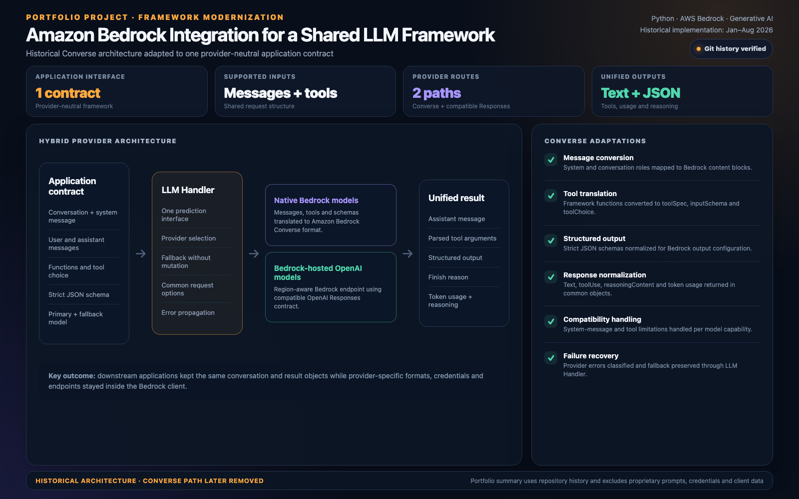
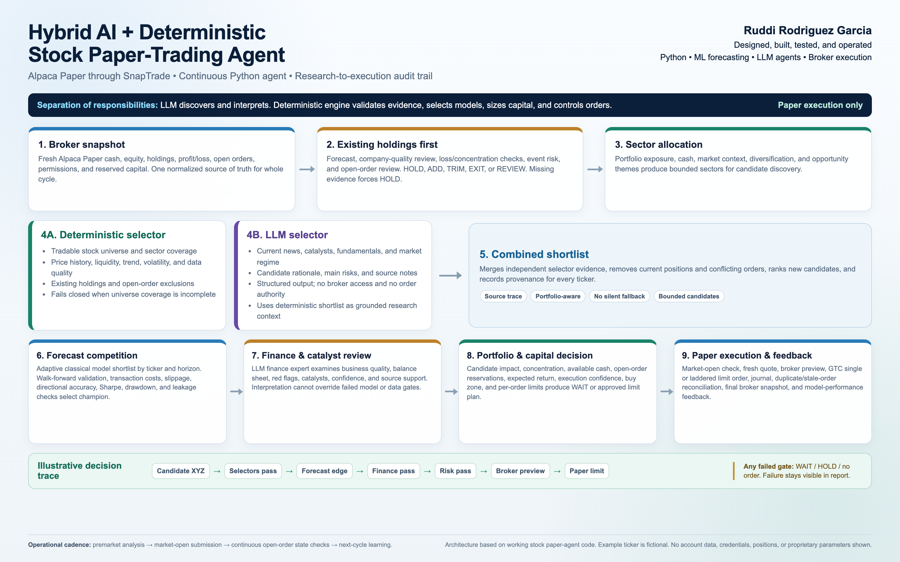

# Ruddi Rodríguez-García — AI & Data Portfolio

Selected work in AI agents, predictive analytics, data workflows and scientific computing. PhD research background combined with practical Python development.

## Start here

- [Download the nine-page portfolio deck](presentations/portfolio-deck.pdf)
- [Explore the adaptive interview-agent source example](examples/adaptive-interview-agent/README.md)
- [Browse the runnable technology-library demo](https://github.com/RuddiRodriguez/product-library-demo)

## Selected presentations

| Work | What it shows | Material |
|---|---|---|
| AI provider integration | Shared AI interface, structured results and fallback | [View presentation](presentations/ai-integration/README.md) |
| Customer response prediction | Data preparation, model selection, validation and ranked outputs | [View presentation](presentations/customer-prediction/README.md) |
| Python AI workflow repair | API repair, output validation and failure handling | [View presentation](presentations/workflow-repair/README.md) |
| Scientific simulation | Stochastic modelling and reproducible analysis | [View presentation](presentations/scientific-simulation/README.md) |
| Hybrid paper-trading agent | Research agents combined with deterministic controls | [View presentation](presentations/paper-trading-agent/README.md) |
| Trading platform | Market data, research, risk and broker integration | [View presentation](presentations/trading-platform/README.md) |
| Historical forecast report | A saved research output from August 2026 | [View presentation](presentations/forecast-report/README.md) |
| Speech translation | Prepared demonstration with synthetic voice input | [View presentation](presentations/speech-translation/README.md) |

### AI integration

### Customer prediction

### Agent orchestration

## Source examples

### Adaptive interview agents

A research excerpt coordinating engagement, sensitivity, completeness and conversation-flow agents, with a contextual follow-up generator. Includes fictional sample data, original research modules with documented adaptations, a scripted offline walkthrough and five behavior checks.

[Read the example and run instructions](examples/adaptive-interview-agent/README.md)

### Technology Library

Collect public resource metadata, normalize records, merge repeated discoveries and browse a searchable Streamlit dashboard with CSV/JSON downloads.

[Case study](case-studies/technology-library.md) · [Source, sample data and setup](https://github.com/RuddiRodriguez/product-library-demo)

## Reading the evidence

Presentations describe prior work, historical results or explicitly labelled demonstrations. Each presentation page explains its scope. Figures in older visuals are not new benchmark results or claims about current production operation. Public examples exclude client records, credentials and private service configuration.

The interview example is a research adaptation. Its offline output is scripted and does not establish live model performance. Employer and internal project names are omitted from the portfolio descriptions.

## Adding future work

Use the [case-study template](templates/case-study.md). Keep approved screenshots, sample outputs and demonstrations beside their case study, with setup instructions and a clear distinction between implemented, tested and deployed behavior.
