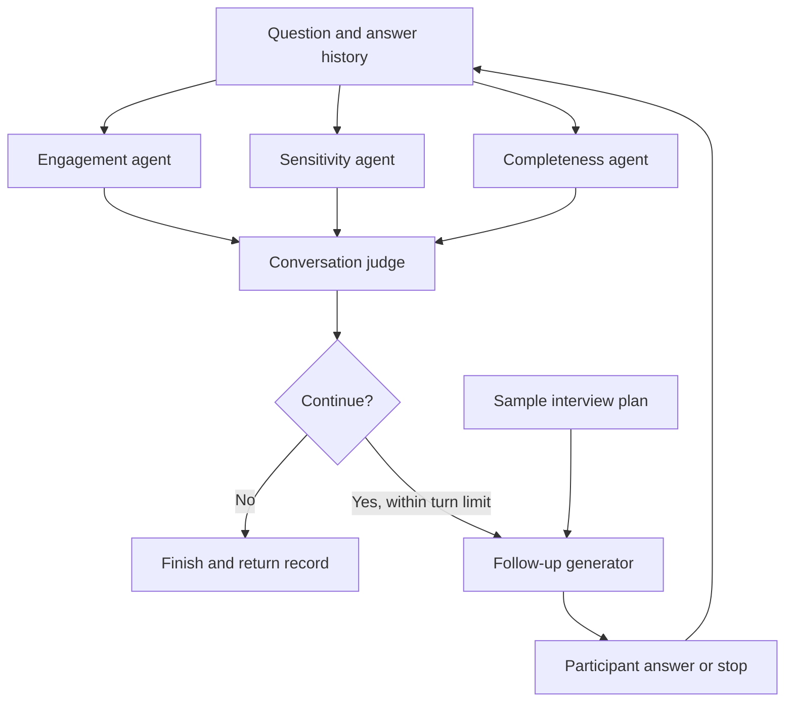

# Adaptive interview agents

A public research example adapted from an existing conversational-interview prototype. Specialist agents assess engagement, sensitivity and answer completeness, then a conversation judge decides whether to continue. A separate generator creates one follow-up using the conversation history and a plan.

The source modules retain the original class-based style. The public runner and fictional sample make the excerpt usable without the original survey workbook or experiment-tracking service.

## Try the offline walkthrough

Python 3.10 or newer. No additional packages, credentials or network calls required.

```bash
cd examples/adaptive-interview-agent
python demo.py
python -m unittest -v
```

[View the sample input](sample.json) and [generated walkthrough output](sample-output.json).

**The walkthrough uses fixed, scripted responses. It demonstrates orchestration and stopping behavior, not model intelligence, model accuracy or live API performance.**

## Workflow



Calls execute sequentially in this small example. The runner stops on sensitive content, the judge's stop decision, a participant stop command, or the follow-up limit. These controls remain dependent on the accuracy of model classifications, except for the explicit stop command and turn cap.

## Source guide

| File | Responsibility |
|---|---|
| `workflow.py` | Coordinates agents and enforces the stop conditions |
| `agents/engagement/` | Evaluates participation in the conversation |
| `agents/sensitivity/` | Assesses sensitive emotional or private content |
| `agents/sufficiency/` | Evaluates answer completeness |
| `agents/termination/` | Combines assessments into continue/stop |
| `followup_conversation_thread.py` | Generates a contextual follow-up |
| `prompts/` | Agent instructions and output-tool definitions |
| `demo.py` | Scripted offline client for inspection and testing |
| `test_workflow.py` | Tests stopping behavior and bounded execution |

## Connecting a real model

`run_interview(client, model, sample, read_answer, max_turns=3)` accepts an externally configured client implementing `client.chat.completions.create(...)`. The retained research modules use function tools, required tool selection and temperature settings. Choose a model and client that support those options.

`sample` follows the shape in `sample.json`. `read_answer` is a function receiving the follow-up question and returning the participant's answer; returning `None` or a stop command ends the interview. The return value contains the conversation, agent assessments and stop reason.

Real model calls require separately configured credentials and can incur usage charges. This publication does not configure credentials or run live inference. Provider errors propagate to the caller; this research excerpt has no retry, hosting, authentication or monitoring layer.

## Adaptations for publication

- Excluded survey workbooks, respondent IDs, chat histories, experiment traces and private configuration.
- Replaced the workbook-based launcher with fictional input and a dependency-free offline demonstration.
- Used a fixed example plan; the original summary and planning services are outside this excerpt.
- Enforced the judge's stop decision and bounded follow-up count in the new runner.
- Corrected the sensitivity tool name and its allowed labels to match the prompt instructions.
- Passed survey history into the generator's timeline field.
- Required the declared output tool and removed abandoned commented-out code.

## Validation and limits

Five offline checks passed on 29 September 2026: agent termination, participant stop, sensitive-content stop, turn limit and rejection of an unknown judge decision. The walkthrough output was generated with the included scripted client.

The completeness rubric is a research heuristic based on detail counts, not a validated universal measure. This excerpt is not the production interview service and does not reproduce its exact business rules. Live inference, privacy performance and model-quality benchmarks were not evaluated for this publication.

[Back to portfolio](../../README.md)
