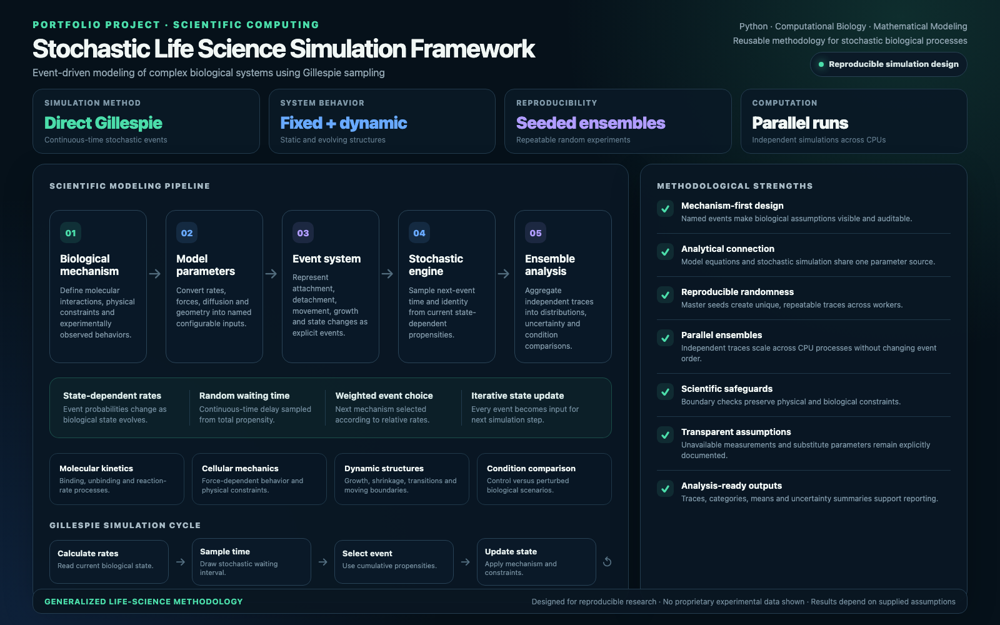

# Scientific simulation

Generalized explanation of stochastic biological modelling, reproducible runs and analysis. A methodology presentation rather than a newly validated scientific result.

[Download presentation PDF](overview.pdf)

[Back to portfolio](../../README.md)
