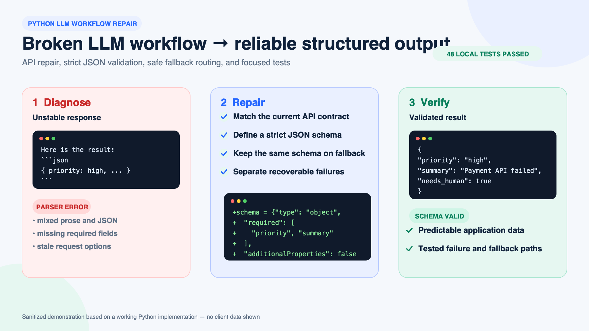

# Python AI workflow repair

Sanitized demonstration of API repair, structured output checks and failure handling. The 48-test figure is a historical local result shown in the original visual; it was not rerun for this portfolio upload.

[Download presentation PDF](overview.pdf)

[Back to portfolio](../../README.md)
